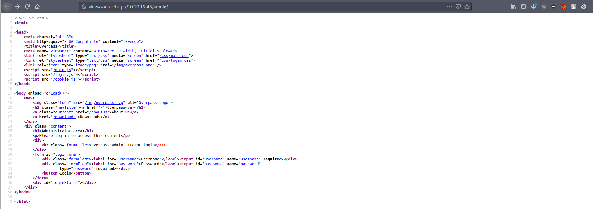
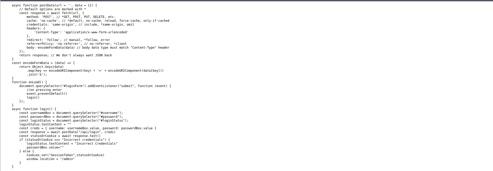
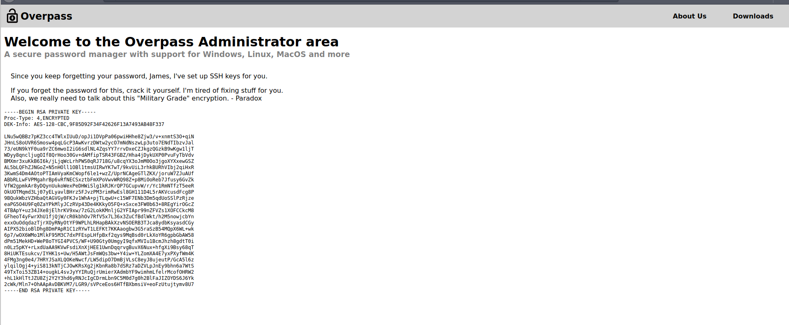
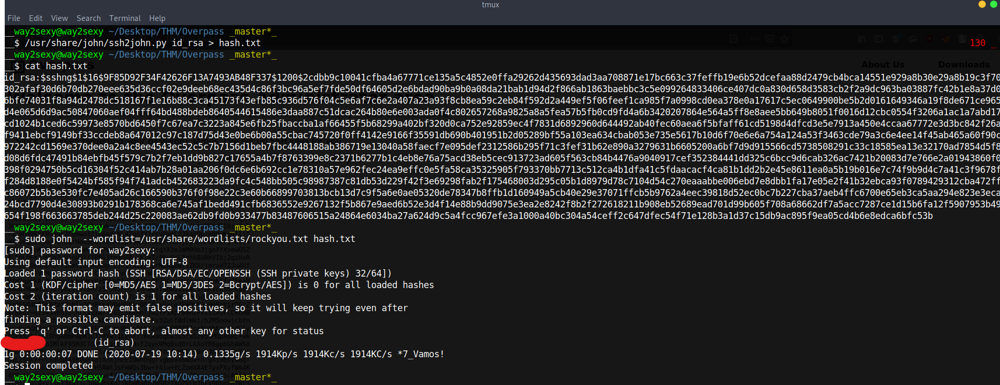
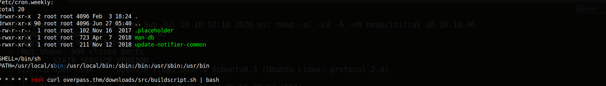

# Overpass Writeup
*Difficulty - Easy*

*Room - Overpass*

*Created by: NinjaJc01*

## The inital scan shows TCP ports 22 and 80 open. We’ll start enumerating the webpage.

## Enumerating the webpage

### I used wfuzz to do basic fuzzing and within seconds we got the admin login . Let’s check out /admin first. 

## Checking Source Code

### As this room contains OWASP top 10 we should read the source code to hind any hints

### We can we have login.js file which checks for login info

#### Looking at the function login there’s a simple if else statement. Basically, it’s checking if the response is equal to “Incorrect Crentials”. If true, it will display a message saying “Incorrect Credentials”. Otherwise, it will set the cookie named “SessionToken” to the returned statusOrCookie and redirect the user to /admin. Since this is only checking for a cookie named SessionToken let’s just create a cookie and give it a bogus value.
#### So what we can do is make fake cookie named SessionToken and give it a false value and try to reload the page then 

### You can make the fake cookie with Firefox or whatever browser using through the Cookie Editor. Once you've made the cookie reload the page 

### We’re greeted with an encrypted RSA private key. Based on the message we see it was created for james.
### Since the RSA key is encrypted we’ll use ssh2john and john to crack the hash. I saved the hash as hash.txt and then use john to crack the hash 

### We can then SSH to the box as user James and run our linpeas.sh to look for Privilage Escalation vectors.

### We see a cronjob that’s trying to download a shell script using curl from overpass.thm then pipes it to bash.
### From linpeas it also showed that we have write rights on /etc/hosts. So we can change the /etc/hosts overpass.thm to our THM IP .

