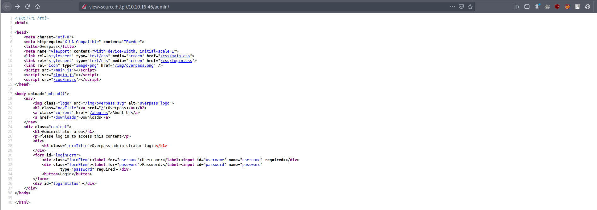
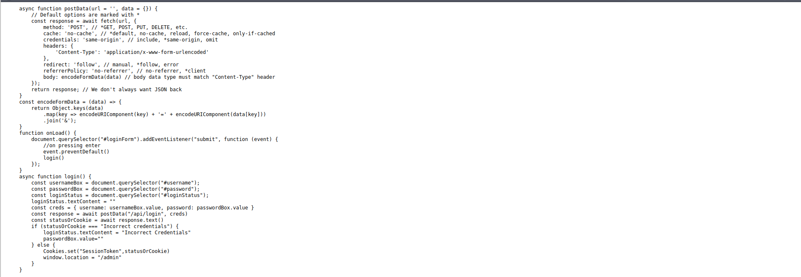
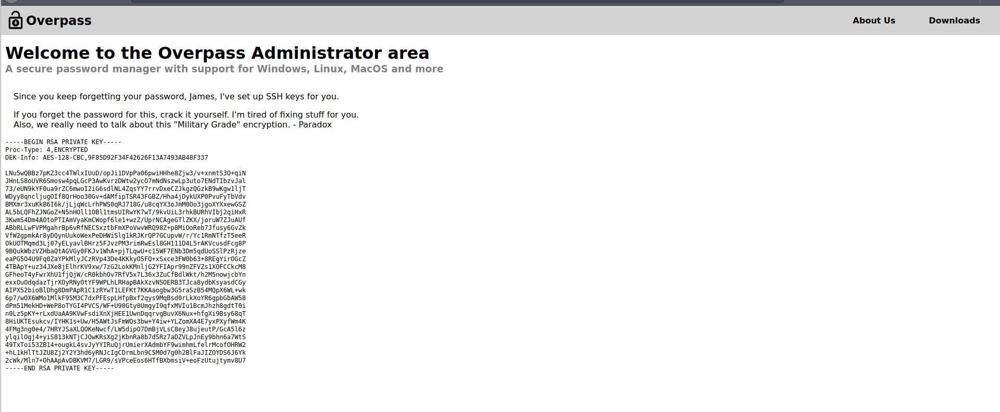
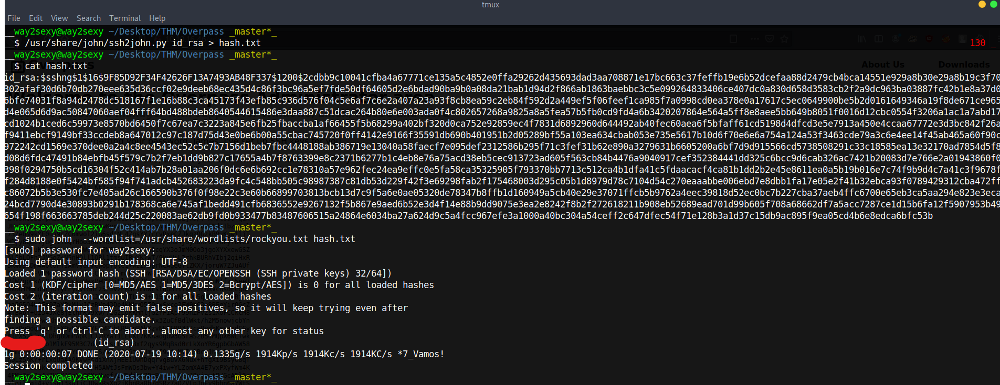
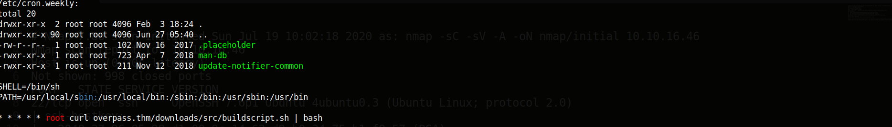
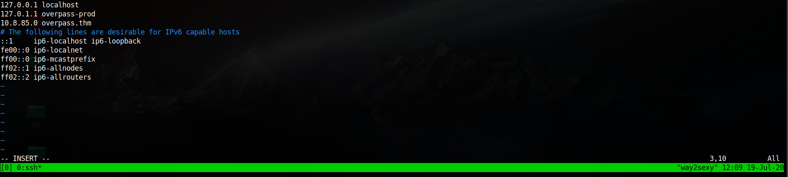
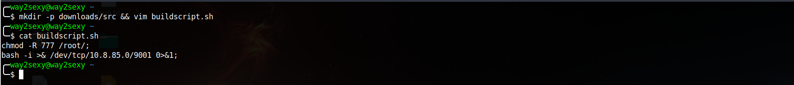
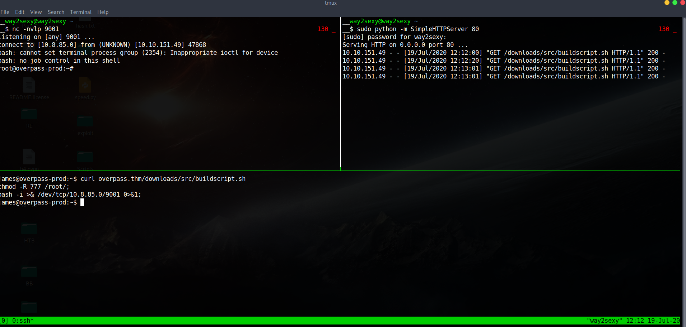
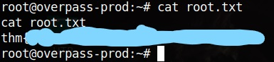

# Overpass Writeup
*Difficulty - Easy*

*Room - Overpass*

*Created by: NinjaJc01*

https://tryhackme.com/room/overpass

## The inital scan shows TCP ports 22 and 80 open. We’ll start enumerating the webpage.

## Enumerating the webpage

### I used wfuzz to do basic fuzzing and within seconds we got the admin login . Let’s check out /admin first. 

## Checking Source Code

### As this room contains OWASP top 10 we should read the source code to hind any hints

### We have login.js file which checks for login info

#### Looking at the function login there’s a simple if else statement. Basically, it’s checking if the response is equal to “Incorrect Crentials”. If true, it will display a message saying “Incorrect Credentials”. Otherwise, it will set the cookie named “SessionToken” to the returned statusOrCookie and redirect the user to /admin. Since this is only checking for a cookie named SessionToken let’s just create a cookie and give it a bogus value.
#### So what we can do is make fake cookie named SessionToken and give it a false value and try to reload the page then 

### We make the fake cookie with Firefox or whatever browser using through the Cookie Editor. Once we've made the cookie, just reload the page 

### We’re greeted with an encrypted RSA private key. Based on the message we see it was created for james.
### Since the RSA key is encrypted we’ll use ssh2john and john to crack the hash. I saved the hash as hash.txt and then use john to crack the hash 

### We can then SSH to the box as user James and run our linpeas.sh to look for Privilage Escalation vectors.

### We see a cronjob that’s trying to download a shell script using curl from overpass.thm then pipes it to bash.
### From linpeas it also showed that we have write rights on /etc/hosts.
### So we now know there’s a cronjob running and we know what it does. Here we can trick curl to download a script we create called buildscript.sh from our web server. In order for this to work we’ll need overpass.thm to resolve to our ip address.

### Now that we have overpass.thm resolving to our IP address we can create the directory structure to mimic the URL curl is requesting.
### We can use the command mkdir -p downloads/src && vim buildscript.sh to make this dir in our attack machine .

 
 ### We have our fake buildscipt ready. Start a python http server on port 80 in the /overpass directory. The directory structure matters
 # Remember to keep the directory structure same otherwise it won't work and start the python server in correct pwd .
 
 
 
 ### Yosh We got the root shell and now we can navigate to /home/james to get user.txt and /root to get the root.txt
 
 
 
 ### This was a really good and fun room . I learnt alot of new things ;D
 ### Arigato <3
